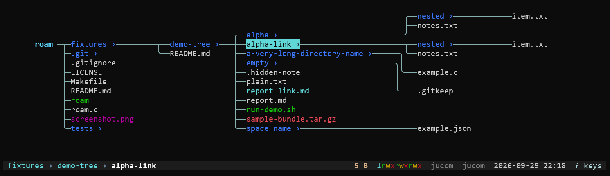

# roam

A small Linux terminal file explorer written in C11. It opens the alternate
screen and draws opened directories as a connected tree centered on the focused
branch. Entries use `LS_COLORS` when set. No external libraries are needed.



Build with `make`, then run `./roam [directory]`. Without a directory argument it
starts in the current working directory. Run it from an interactive terminal.
Set `EDITOR` to a terminal editor (arguments are allowed, e.g. `EDITOR='vim -u NONE'`).

- Up/Down (or `k`/`j`): select an entry
- Right (or `l`): open the selected directory; it stays expanded when moving back
- Left (or `h`): open the parent directory, including from the starting column
- Space: open or close the selected directory's tree without moving focus;
  opened directories stay visible in groups within their depth column until closed individually
- Shift+Space (or `H`): show the current directory as the view root, hiding its
	ancestors without changing focus, selection, or opened descendants
- `A`: toggle the full ancestor chain up to `/`
- Enter (or `e`): open the selected file or directory with `$EDITOR`
- `n` / `N`: create a file / directory in the current directory
- `r`: rename the selected entry (never overwrites another entry)
- `d`: remove the selected entry after confirmation (directories must be empty)
- `?`: show the centered key reference (Escape or `q` closes it)
- Escape, `q`, or Ctrl-C: quit and restore the previous screen

Roam requests Kitty keyboard reporting while it is open so supported terminals
can distinguish Shift+Space from Space. Use `H` if the terminal does not support it.

To change the calling shell's directory, put `roam` on your `PATH` and add this
`cdi` function to your shell configuration:

```sh
cdi() {
	local destination
	destination="$(command roam --cd "$@")" || return
	if [ -n "$destination" ]; then
		builtin cd -- "$destination"
	fi
}
```

In `--cd` mode, press `c` on a selected directory to choose it, or `q` to
cancel. The interface stays on the terminal; only the selected path is written
to stdout for the shell to consume. A program cannot change its parent shell's
working directory directly.

Entries are sorted by name. Right opens only directories; Enter/`e` delegates
file and directory editing to the configured editor. The browser includes hidden
entries other than `.` and `..`. Entry colors
follow `LS_COLORS` when it is set, including file types and filename patterns;
without it, entries use the terminal's default colors.